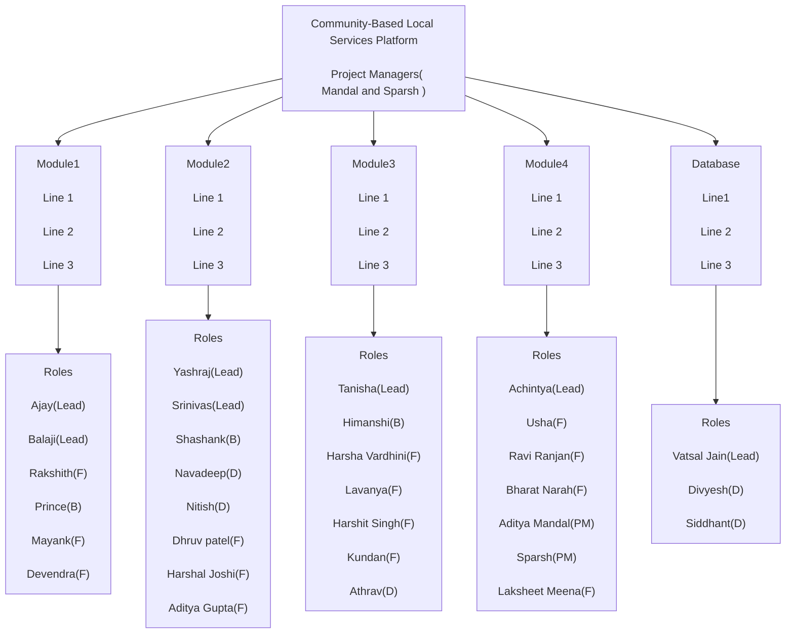

# CS346 - Software Engineering Laboratory
## Assignment-3 (GROUP 1A)
## Title: Community-Based Local Services Platform
Welcome to our Community-Based Local Services Platform. Our platform, is designed for users to streamline the process of finding, booking, and engaging with Service-Providers(decorators) in your area.

## Key Features

**1. Service Provider Profiles (Decorator):** Users can explore detailed profiles of decorators, complete with photos, descriptions, service categories, pricing, and service areas. Decorators showcase their expertise, qualifications, and availability, enabling users to make informed decisions.

**2. Search and Booking:** A prominent search bar and filters allow users to refine their searches for specific service providers. Listings display ratings, reviews, and available appointment slots, facilitating easy scheduling directly through the platform.

**3. Messaging and Notifications:** Clear communication channels, including messaging and alerts, ensure seamless interaction between users and decorators. Users receive notifications for bookings, reminders, and updates, enhancing the overall experience.

**4. Rating and Reviews:** Ratings and reviews are prominently displayed on decorator profiles, enabling users to provide valuable feedback and make informed choices based on the experiences of others.

**5. Secure Payment Integration:** Users can choose from various payment methods for transactions, with a secure payment gateway ensuring a safe and convenient process.

**6. Feedback and Support:** User-friendly forms and dedicated support channels allow for interactions related to chosen service providers, with feedback collected for continuous improvement.

## Project Team's Organization:
A hierarchical structure outlining group's various functions, sub-functions and assigned roles.

Roles:
- `Product Manager`
- `Lead- Team or Module Lead`
- `F-Frontend`,   
- `B-Backend`
- `D-Database`

